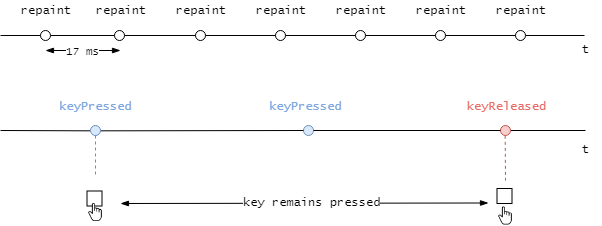
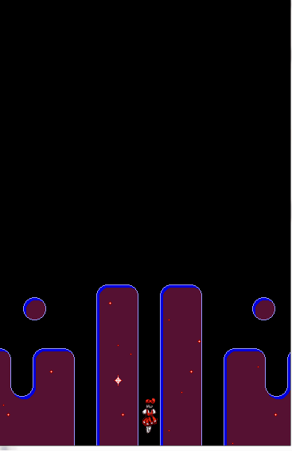

## TechKids - Code Intensive - Hướng dẫn thực hành
### Cải thiện di chuyển của nhân vật

1. Để làm cho di chuyển của nhân vật mượt mà hơn, cần thay đổi cách cập nhật tọa độ của nhân vật

2. Ở code hiện tại, tọa độ của nhân vật được cập nhật mỗi khi `onKeyPressed` được gọi

<pre>
@Override
public void keyPressed(KeyEvent e) {
    if(e.getKeyCode() == KeyEvent.VK_LEFT) {
        <b>playerX -= 5;</b>
    } else if (e.getKeyCode() == KeyEvent.VK_RIGHT) {
        <b>playerX += 5;</b>
    } else if (e.getKeyCode() == KeyEvent.VK_UP) {
        <b>playerY -= 5;</b>
    } else if(e.getKeyCode() == KeyEvent.VK_DOWN) {
        <b>playerY += 5;</b>
    }
    repaint();
}
</pre>

3. Việc cập nhật vào các thuộc tính playerX, playerY như trên thì không sai, tuy nhiên tốc độ gọi hàm `onKeyPressed` khi người dùng giữ chặt một phím trong `Swing` thường chậm hơn nhiều so với tốc độ gọi hàm `repaint()` (khoảng cách hai lần gọi `onKeyPressed` thường lớn hơn 17ms nhiều) gây cảm giác lag giật do tọa độ cập nhật không kịp

4. Do vậy, cần thay đổi phần di chuyển của nhân vật này theo hướng __để thao tác thay đổi tọa độ nhân vật, nếu có, cùng chỗ với `repaint()` để chúng có tốc độ ngang nhau, và bản thân hàm `keyPressed()` sẽ chỉ đóng vai trò quyết định hướng di chuyển của nhân vật__

5. Xóa thao tác thay đổi nhân vật trong hàm `keyPressed()`

<pre>
@Override
public void keyPressed(KeyEvent e) {
    if(e.getKeyCode() == KeyEvent.VK_LEFT) {
        <b><s>playerX -= 5;</s></b>
    } else if (e.getKeyCode() == KeyEvent.VK_RIGHT) {
        <b><s>playerX += 5;</s></b>
    } else if (e.getKeyCode() == KeyEvent.VK_UP) {
        <b><s>playerY -= 5;</s></b>
    } else if(e.getKeyCode() == KeyEvent.VK_DOWN) {
        <b><s>playerY += 5;</s></b>
    }
    repaint();
}
</pre>

5. Mở file `GameCanvas.java`, trong hàm `gameLoop()` gọi hàm `updatePlayerPosition()` trước khi gọi repaint()

<pre>
public void gameLoop() {
  while(true) {
    <b>updatePlayerPosition();</b>
    repaint();
    try {
      Thread.sleep(17);
    } catch (InterruptedException e) {
      e.printStackTrace();
    }
  }
}
</pre>

Chú ý: hàm <b>updatePlayerPosition()</b> này chưa tồn tại, sẽ được khai báo sau

6. Trong class `GameCanvas`, khai báo hàm `updatePlayerPosition()`

<pre>
<b>void updatePlayerPosition() {

}</b>

public void gameLoop() {
  ...
}
</pre>

7. Trong `updatePlayerPostion()`, cập nhật tọa độ của nhân vật dựa vào trạng thái của các phím

<pre>
void updatePlayerPosition() {
    <b>if(leftPressed) {
        playerX -= 5;
    }
    if(rightPressed) {
        playerX += 5;
    }
    if(upPressed) {
        playerY -= 5;
    }
    if(downPressed) {
        playerY += 5;
    }</b>
}
</pre>

Chú ý: Các thuộc tính `leftPressed`, `rightPressed`, `topPressed`, `downPressed` là các thuộc tính kiểu `boolean`, dùng để đánh dấu liệu các phím &larr; &rarr; &uarr; &darr; theo thứ tự đó có đang được nhấn hay không. Ví dụ: nếu `rightPressed` đang có giá trị `true`, nghĩa là phím &rarr; đang được nhấn, ngược lại, nếu đang có giá trị là `false`, phím &rarr; đang không được nhả ra.
Các thuộc tính này, giống nhu `updatePlayerPosition()` ở mục 7, chưa tồn tại, sẽ được khai báo và xử lý sau

8. Thực hiện khai báo bốn thuộc tính `boolean`: `leftPressed`, `rightPressed`, `topPressed` và `downPressed`

<pre>
<b>
boolean leftPressed;
boolean rightPressed;
boolean upPressed;
boolean downPressed;
</b>
void updatePlayerPosition() {
  ...
}
</pre>

9. Chạy chương trình

10. Kết quả là nhân vật không được di chuyển theo phím bấm. Lý do là vì mặc dù đã có hàm `updatePlayerPosition()` với nhiệm vụ thay đổi tọa độ nhân vật và được gọi trước mỗi `repaint()`, bốn thuộc tính `leftPressed`, `rightPressed`, `topPressed` và `downPressed` không được cập nhật theo phím bấm nên luôn bằng `false`

9. Thao tác để `leftPressed`, `rightPressed`, `topPressed` và `downPressed` phản ánh đúng trạng thái của bốn phím tương ứng bằng cách cập nhật lại hàm `keyPressed` và `keyReleased`

<pre>
@Override
public void keyPressed(KeyEvent e) {
    if(e.getKeyCode() == KeyEvent.VK_LEFT) {
      <b>leftPressed = true;</b>
    } else if (e.getKeyCode() == KeyEvent.VK_RIGHT) {
      <b>rightPressed = true;</b>
    } else if (e.getKeyCode() == KeyEvent.VK_UP) {
      </b>upPressed = true;</b>
    } else if(e.getKeyCode() == KeyEvent.VK_DOWN) {
      <b>downPressed = true;</b>
    }
}

@Override
public void keyReleased(KeyEvent e) {
  <s><b>System.out.println("keyReleased");</b></s>
  <b>if(e.getKeyCode() == KeyEvent.VK_LEFT) {
    leftPressed = <i>false;</i>
  } else if (e.getKeyCode() == KeyEvent.VK_RIGHT) {
    rightPressed = false;
  } else if (e.getKeyCode() == KeyEvent.VK_UP) {
    upPressed = false;
  } else if(e.getKeyCode() == KeyEvent.VK_DOWN) {
    downPressed = false;
  }</b>
}
</pre>

10. Chạy chương trình

11. Kết quả là nhân vật đã có thể di chuyển một cách mượt mà khi người dùng nhấn các phím mũi tên

Hiện tại, nhân vật có thể di chuyển vượt ra khỏi `GameCanvas`. Việc giới hạn di chuyển nhân vật sẽ được thực hiện ở các bài sau
