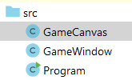
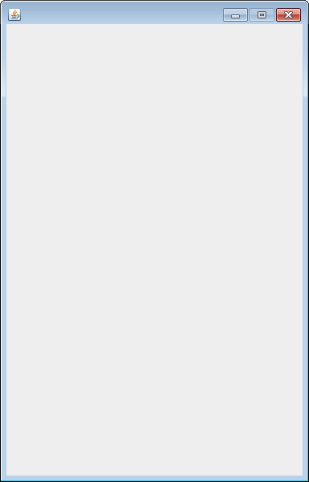
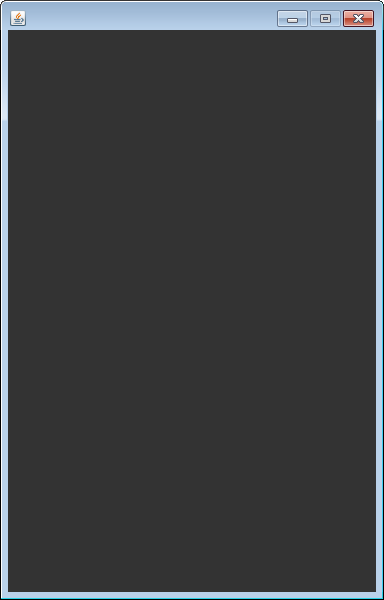

## TechKids - Code Intensive - Hướng dẫn thực hành
### Chuẩn bị game canvas

1. Tạo một file java mới, tên là `GameCanvas.java`

2. Để `GameCanvas` trở thành bề mặt hiển thị game (có thể vẽ lên được), thêm `extends JPanel` vào đằng sau khai báo của `GameCanvas`

<pre>
public class GameCanvas <b>extends JPanel</b> {
}
</pre>

Có thể sử dụng chức năng autocomplete của IntelliJ như đã làm ở phần [Chuẩn bị game window](setup_game_window.md) hoặc tự thêm `import javax.swing.*;` để được kết quả như sau:

<pre>
<b>import javax.swing.*;</b>

public class GameCanvas <b>extends JPanel</b> {
}
</pre>

3. Can thiệp vào hàm `paintComponent` (không phải `paintComponent*s*`) của `GameCanvas` để có thể thực hiện việc hiển thị game, bằng cách viết `paint` vào trong class `GameCanvas`, rồi chọn `paintComponent` từ gợi ý của IntelliJ rồi nhấn `ENTER`

Chú ý rằng sau khi nhấn `ENTER`, một thư viện khác sẽ được import vào file `GameCanvas.java`, toàn bộ khai báo hàm và thân hàm của `paintComponent` cũng sẽ được IntellJ điền nốt

<pre>
import javax.swing.*;
<b>import java.awt.*;</b>

public class GameCanvas extends JPanel {
    <b>@Override
    protected void paintComponent(Graphics g) {
        super.paintComponent(g);
    }</b>
}

</pre>

5. Trong đoạn code sinh ra ở trên, trước mắt cần quan tâm đến `Graphics g`, các phần như `@Override` hay `super` sẽ được trình bày ở các bài sau

6. Xóa dòng `super.paintComponent(g);` để viết lại hoàn toàn hàm `paintComponennt()`

7. Nếu như `GameCanvas` được coi như bề mặt để hiển thị game thì `Graphics g` được coi như cây cọ dể vẽ lên bề mặt đó. Sử dụng `Graphics g` để tô màu toàn bộ `GameCanvas` (nếu không viết gì thêm thì màu mặc định sẽ là màu đen) và song song là dể kiểm tra xem `paintComponent` có được gọi không

<pre>
@Override
protected void paintComponent(Graphics g) {
    <b>g.fillRect(0, 0, 800, 600);</b>
}
</pre>

8. Chạy chương trình

9. Sẽ được kết quả là `GameWindow` <b>vẫn màu trắng như cũ</b>, lý do là `GameCanvas` đã được khai báo nhưng chưa được mang ra dùng

10. Lắp `GameCanvas` vào `GameWindow`

Bật file `GameWindow.java`, trong class `GameWindow`, khai báo thêm thuộc tính (property) `GameCanvas gc`

<pre>
public class GameWindow extends JFrame {
    <b>GameCanvas gc;</b>
    public GameWindow() {
      ...
</pre>

11. Trong hàm tạo `GameWindow()`, trước `setVisible(true)`, khởi tạo `gc`

<pre>
public GameWindow() {
    ...
    <b>gc = new GameCanvas();</b>
    setVisible(true);
}
</pre>

12. Sau khi thực hiện khởi tạo, lắp `GameCanvas gc` này vào `GameWindow` sử dụng hàm `setContentPane()`

<pre>
public GameWindow() {
    ...
    gc = new GameCanvas();
    <b>setContentPane(gc);</b>
    setVisible(true);
}
</pre>

13. Chạy chương trình

14. Có thể thấy, `GameCanvas` cùng hàm `paintComponent` với thao tác tô màu đen toàn màn hình đã phát huy tác dụng. `GameCanvas` đã chuẩn bị xong

*Bài tiếp theo [Thêm hình nền](add_background.md)*